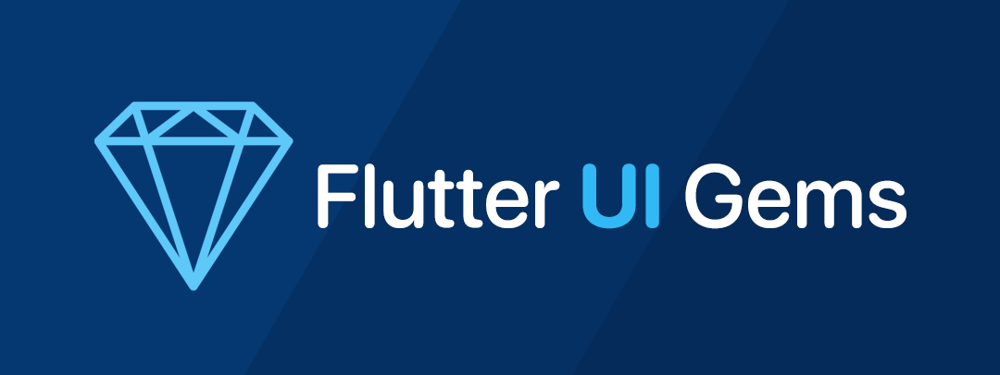

# Flutter UI Gems

The idea behind the project is to create popular and effective **Flutter UI elements** (even fullscreen layouts) that you can use in your next project or simply learn some new tricks for animations and structuring.

The source code is **100% Dart** and, in most cases, does not rely on any third-party library or package except for support for SVG files where needed.

## Requirements

- Any Operating System (ie. MacOS, Linux, Windows)
- Any IDE with Flutter SDK installed (ie. IntelliJ, Android Studio, VSCode, etc)
- A basic knowledge of Dart and Flutter

## :gem: Gems

### :gem: 01: [Shockwave](gems/01-shockwave/)

Beautiful wave animation effect that ripples through a grid of elements.

<video src="gems/01-shockwave/assets/preview.mp4" placeholder="gems/01-shockwave/assets/preview.png" autoplay loop controls muted title="Showckwave" width="300">
Sorry, your browser doesn't support HTML 5 video.
</video>

## Maintainers

- **Zoran Juric** - [@juzo](https://github.com/juzo)

You can help make this project better, feel free to open an [new issue](https://github.com/juzo/FlutterUIGems/issues/new) or a [pull request](https://github.com/juzo/FlutterUIGems/pulls).

## License

This project is licensed under the MIT License - see the [LICENSE](LICENSE) file for details.
